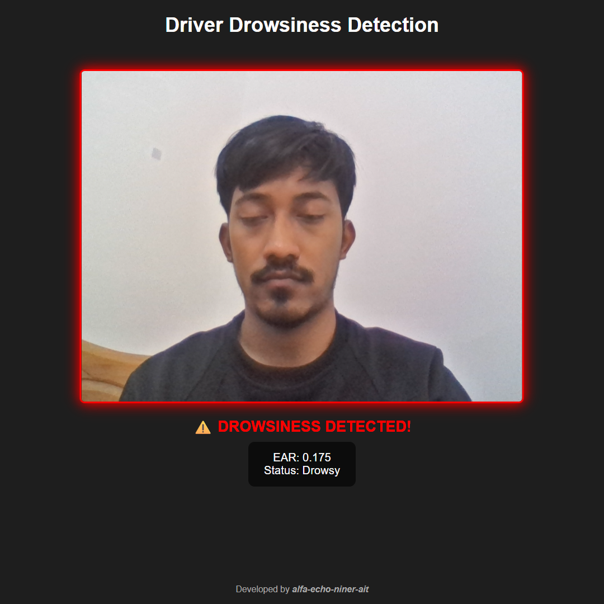

# Driver Drowsiness Detection Web App  

**Real-Time Eye Closure Detection Using MediaPipe, OpenCV & Flask**

A web-based drowsiness detection system that uses facial landmarks from webcam video to detect eye closure using **Eye Aspect Ratio (EAR)**. Works in both **desktop and mobile browsers**.

<div align ="center">



</div>

### Perfect for:

🧠 Research in driver safety

💻 Computer vision demos

📱 Mobile-friendly applications

📐 EAR-based fatigue detection


---

## 🔍 Overview

This project implements a lightweight, real-time **driver drowsiness detection system** using:

- **MediaPipe FaceMesh** – for 468 facial landmarks
- **OpenCV** – For image processing, drawing eye landmarks, and video manipulation
- **Flask** – Backend processing
- **HTML + JavaScript** – Frontend UI with live webcam access
- **Eye Aspect Ratio (EAR)** – For blink/drowsiness detection
- **Audio alert** – Visual + sound alert when eyes are closed too long

No need for extra hardware, all we need is a **webcam-enabled device** and a modern **browser**.

---

## 🧩 Features

✅ Real-time webcam feed  
✅ EAR calculation per frame  
✅ Visual + audio alert on drowsiness  
✅ Responsive design (mobile/desktop friendly)  
✅ Easy setup – no complex dependencies  
✅ Works over local network or via Ngrok  

---

## 🛠️ Tools Versions

| Tool | Version |
|------|---------|
| Python | 3.12.1 |
| Flask | 3.1.1 |
| MediaPipe | 0.10.21 |
| OpenCV | 4.11.0.86 |
| SciPy | 1.15.3 |
| Base64 | Built-in |
| ngrok (optional) | For HTTPS tunneling |

---

## 🚀 How to Run

1. Clone or download the repo

2. Install dependencies:

```bash
pip install -r requirements.txt
```
Or,

```bash
pip install flask mediapipe opencv-python numpy scipy
```

3. Start the Flask server:

```bash
python app.py
```

4. Open browser at:

```
http://localhost:5000
```

5. (Optional) Use [Ngrok](https://ngrok.com/downloads/) for mobile testing:

```bash
ngrok http 5000
```

Open the generated URL on any device.

---

## 🖥️ Usage

1. Allow camera access when prompted.
2. The app will calculate EAR every 200ms.
3. If EAR < threshold (`0.22`) for 10+ frames → "DROWSINESS DETECTED!" alert appears.
4. Audio alarm plays automatically.
5. Once eyes reopen, status resets to "Awake".

---

## ⚙️ Technical Details

### Eye Landmarks Used

```python
LEFT_EYE = [362, 385, 387, 263, 373, 380]
RIGHT_EYE = [33, 160, 158, 133, 153, 144]
```

### EAR Formula

$$
\text{EAR} = \frac{(A + B)}{(2 \times C)}
$$

Where:
- $ A = \text{Top-left to bottom-left vertical distance} $
- $ B = \text{Top-right to bottom-right vertical distance} $
- $ C = \text{Left corner to right corner horizontal distance} $

Threshold: `0.22`  
Frame Count to Trigger Alert: `10`

---

## 🎨 UI Preview

| Feature | Description |
|--------|-------------|
| Webcam Video | Flipped to match natural view |
| EAR Display | Real-time eye aspect ratio shown |
| Status Text | Shows "Awake" or "Drowsy" |
| Red Glow + Flash | Visual alert when drowsy |
| Audio Alert | Plays sound when drowsiness detected |

---

## 📋 License

MIT License – see [LICENSE](LICENSE)

---

## 📬 Feedback & Contributions

Contributions are welcome! Feel free to open issues or PRs.

👤 **Maintainer**: Ayub Ali Emon (emon@sdust.edu.cn), member of  [CogTwins Lab](https://cogtwins.github.io/), Shandong University of Science and Technology.